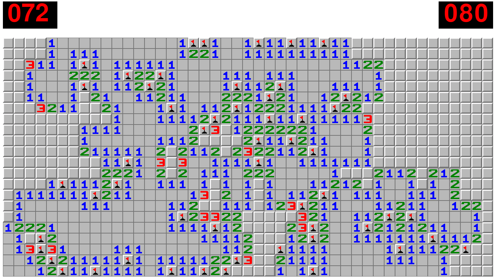
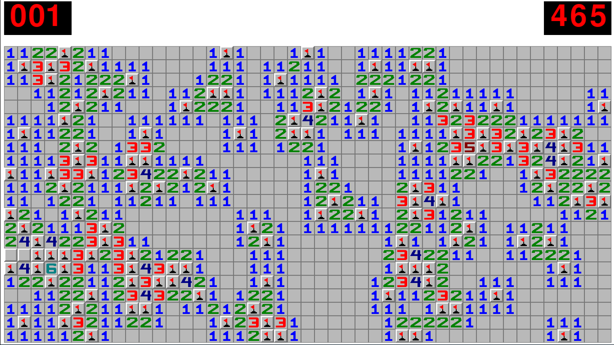

# Mine_sweeper
Mine Sweeper implementation in pygame with classes. I hope this helps you to make your own mine sweeper!

## Controls
-'Right Click' to flag/unflag mines.

-'Esc' to exit the game

-'Space' to reset the game

## Features
- You can click on the numbers to flag remaining adjacent cells or reveal the remaing adjacent cells.
- You can use 'solve=True' to automaticly solve the board.

